# readset

[](https://github.com/yuktha-g/readset/actions/workflows/ci.yml)
[](https://github.com/yuktha-g/readset/blob/main/pyproject.toml)
[](https://github.com/yuktha-g/readset/blob/main/pyproject.toml)
[](https://github.com/yuktha-g/readset/blob/main/pyproject.toml)
[](LICENSE)

**Snapshot isolation for AI agents.** readset stops parallel coding agents from silently
overwriting each other, by validating every write against what the agent actually read.

Zero dependencies. No daemon. One command to install. Works with Claude Code today; Codex CLI adapter included.

## The problem

You have two Claude Code terminals open on the same repo, or one session that fans out
subagents. Agent A reads `billing.py` and starts a refactor. Agent B reads the same file,
fixes the tax rate, and writes. Agent A then writes its refactor from its old copy, and B's
fix is gone. Nothing errored. Nobody noticed. The tests you run later will not know which
version was supposed to win.

This is not rare. A study of 142,000+ pull requests opened by AI coding agents across
59,000+ repositories found a **27.67% merge-conflict rate**, with cross-agent pairs
conflicting at roughly twice the rate of a single agent's own work
([AgenticFlict, AIware 2026](https://arxiv.org/abs/2604.03551)). Git worktrees defer the
collision to merge time; they do not prevent it. What's missing is the thing databases
have had since the 1980s: a transaction that knows what it read, and refuses to commit
on top of a version it never saw.

## What it looks like



```
$ readset demo

readset demo: two agents, one file, no locks

1. agent-a reads billing.py
2. agent-b reads billing.py
3. agent-b changes the tax rate and writes
4. agent-a, still holding its old view, tries to write its refactor

   readset: write to billing.py blocked - the file changed after you read it.

   Changed by: agent-b (Fix)

   --- billing.py (what you read)
   +++ billing.py (on disk now)
   @@ -1,4 +1,4 @@
   -TAX_RATE = 0.18
   +TAX_RATE = 0.20


    def total(net):

   What to do: Read billing.py again, then retry your edit against the current content.

5. agent-a re-reads billing.py and retries against the current content
   write succeeded; both changes are in the file

Without readset, step 4 would have silently discarded agent-b's fix.
```

That message is exactly what the agent receives. It re-reads, retries, and the write goes
through. No merge, no lock, no human in the loop.

## Install

**As a Claude Code plugin (zero setup):**

```
claude plugin marketplace add yuktha-g/readset
claude plugin install readset@readset
```

That's the whole install. The plugin runs readset from its own source with any
`python3 >= 3.10` (no dependencies, nothing to pip install), and initialises a ledger at
the git root of any repository you open, excluded via `.git/info/exclude` so nothing you
commit changes.

**As a CLI (per repo, explicit):**

```
uv tool install readset        # or: pipx install readset
cd your-repo
readset init
```

`readset init` creates `.readset/` (gitignored), and adds hooks to
`.claude/settings.json` for this project. Use `--user` to install into
`~/.claude/settings.json` instead, so every repo you open is covered. `readset uninstall`
removes exactly what `init` added and leaves your other hooks alone.

For Codex CLI: `readset init --agent codex` writes `.codex/hooks.json` (or
`--agent all` for both). Codex has no Read tool, so readset treats any existing repo file
named in a shell command as read, and parses each `apply_patch` into per-file edits so
hunk-level validation applies. The Codex adapter is tested against the documented payloads
but has not yet been run against a live Codex install; reports welcome.

That's it. Open a second Claude Code session on the same repo and have both edit the same
file. One of them will be stopped with a diff.

## How it works

Every agent session (or subagent) is a **transaction**. readset watches Claude Code's tool
calls through hooks:

| Hook event | Tools | What readset does |
|---|---|---|
| `PostToolUse` | `Read` | Records the file's content hash in this transaction's **read set**, and keeps a copy of the content |
| `PreToolUse` | `Edit`, `Write`, `MultiEdit`, `NotebookEdit` | **Validates** the write (below). Blocks it with a diff if validation fails |
| `PostToolUse` | `Edit`, `Write`, `MultiEdit`, `NotebookEdit` | Records the new hash so the transaction never conflicts with its own write |
| `PostToolUse` | `Bash` | Refreshes any read-set path named in the command (handles `sed -i` and friends) |
| `SubagentStart` / `SubagentStop` | | Begins a child transaction; on stop, folds its writes into the parent's read set |
| `SessionStart` / `SessionEnd` | | Begins and ends the session transaction |

**Validation rules**, applied at every write:

1. The file exists and this transaction **never read it**: blocked. That's a blind
   overwrite, the textbook lost update.
2. The file does not exist and was never read: allowed. It's a creation. (If two agents
   race to create the same file, the second finds it exists and is blocked.)
3. The file was read and its hash **still matches disk**: allowed.
4. The file was read and its hash **differs from disk**: blocked, with a diff between
   what you read and what's there now, and the name of the transaction that changed it.
5. **Hunk-level, the default.** For an `Edit` (a string replacement), rule 4 is refined:
   the write is blocked only if the *region you are editing* is within a few lines of a
   change someone else made since you read the file. If the other change is elsewhere in
   the file, or in another file you read, your edit goes through and readset **injects a
   heads-up into the agent's context** with the diff, so it knows without being stopped.
   Full-file writes (`Write`) and `replace_all` edits still need a fresh read.

The fix, when blocked, is always one action: read the file again, then retry. The message
says so.

**Three scopes**, set with `readset init --scope`:

| Scope | Stale target file | Stale other file you read |
|---|---|---|
| `hunk` (default) | Blocked only if your edit overlaps the change; otherwise allowed with a heads-up | Allowed with a heads-up |
| `strict` | Blocked | Blocked |
| `target` | Blocked | Ignored |

How `hunk` stays honest: after an allowed edit, the transaction's view of the file becomes
*what it read plus its own edit*, not what's on disk. The difference between its view and
disk is therefore always exactly what other agents changed, and the next edit to that
region is still caught. Nothing is silently inherited.

**The guarantee, stated precisely.** In `strict` scope: no lost updates, and no writes
based on stale reads. In the default `hunk` scope: no lost updates, and no edit lands within
`hunk_margin` lines (default 3) of a change the agent has not seen; staleness outside that
window is surfaced to the agent rather than enforced. readset does not provide full
serialisability in any scope; two agents can still write-skew across regions that each read
but neither wrote. That is the same trade PostgreSQL makes at `REPEATABLE READ`.

## Why not just locks?

Locks block *before* work. Agents that hold locks while thinking serialise everything and
deadlock when they wait on each other. Optimistic validation lets every agent work at full
speed and only intervenes at the moment a write would actually destroy something. In a
codebase, most concurrent edits touch different files; the optimistic path is the fast
path almost all the time, and the pessimistic path is a re-read.

## Library use

The core has no Claude Code knowledge. Any framework can call it:

```python
from readset import Ledger, Conflict

ledger = Ledger.open("/path/to/repo")  # creates .readset/ if needed
txn = ledger.begin("agent-a")

txn.record_read("src/auth.py")
result = txn.validate_write("src/auth.py")  # Ok | Conflict
if isinstance(result, Conflict):
    print(result.message)  # what to tell the agent
    print(result.changed_by, result.stale_paths)
else:
    ...  # perform the write
    txn.record_write("src/auth.py")

txn.end()
```

`Transaction` has exactly four calls that matter: `record_read`, `validate_write`,
`record_write`, `end`. An adapter for another agent framework is a mapping from that
framework's events onto those four; the Claude Code adapter is about 130 lines and the
Codex one about 150, including its patch parser.

## CLI

```
readset init [--scope hunk|strict|target] [--agent claude|codex|all] [--user]
                                                 initialise this repo, install hooks
readset uninstall [--agent ...] [--user]         remove exactly the hooks init added
readset status                                   live transactions and their read sets
readset log [--limit N] [--json]                 conflicts caught, with diffs
readset doctor                                   check the install; paste its output into a bug report
readset gc [--older-than 24h]                    end stale transactions, free storage
readset demo                                     the collision above, offline
```

`.readset/config.json` also holds `hunk_margin` (default 3) and `diff_max_lines` (default 200).

## Overhead

Measured with `make bench`: each sample is a full `readset hook` subprocess, which is how
Claude Code invokes it, so interpreter start-up is included.

```
readset 0.1.0, python 3.12.14, Linux x86_64, n=30, 1000 tracked files
interpreter start + no-op event      p50   57.1 ms   p95   58.6 ms
PostToolUse Read                     p50   58.0 ms   p95   74.0 ms
PreToolUse Edit, stale check         p50   80.4 ms   p95   89.8 ms
```

readset's own work is about 1 ms for a read and about 23 ms to validate a 1,000-file
read set. The rest is Python starting.

## Under contention

`tests/integration/test_concurrency.py` runs many worker processes against one ledger,
each looping read, validate, increment a shared counter file, record. The counters on disk
must equal the number of successful writes, or an update was lost.

```
8 procs x 40 rounds:    100 writes,   220 conflicts caught, 0 errors, disk total 100
16 procs x 200 rounds:  744 writes, 2,456 conflicts caught, 0 errors, disk total 744   (~1,900 ops/s)
```

Zero SQLite errors under 16-way contention, every conflict logged, every increment
accounted for. The test runs in CI on every push.

## Limitations (v0)

- **Hunk-level applies to string-replacement edits.** A `Write` that replaces a whole file
  needs a fresh read if anything in it changed; there is no three-way merge.
- **Same working directory only.** Agents in separate git worktrees are not validated
  against each other until merge, and readset does not yet hook the merge.
- **Bash is a heuristic.** Edits made with `sed`, `python -c`, or any shell command are
  detected only if the file path appears in the command string. Another agent's shell
  edits are still caught, because validation compares against disk, not against ledgers.
- **Codex adapter is untested against a live install.** Its payload handling follows the
  published hooks reference and is unit-tested; a real-session check is the next step.
- **Codex reads are inferred from shell commands.** A file read through a command that does
  not name it (a script, a glob) is not in the read set, and a later edit to it is treated as
  a blind overwrite until it is read by name.
- `Grep` and `Glob` results are not recorded as reads.

## Roadmap

- Worktree merge validation
- Adapters: Cursor (observe-only until it has a blocking before-edit hook), LangGraph, CrewAI
- Optional auto-merge when hunks don't overlap, off by default

## Safety

The hook is **fail-open**: if anything inside readset throws, the error goes to
`.readset/errors.log` and the tool call proceeds. A guard that can break your session is
worse than no guard. readset never runs commands, never modifies a write, never touches
files outside the repository root, and never uses the network. See `SECURITY.md`.

## Prior art

- Optimistic concurrency control and read-set validation: Kung and Robinson, 1981.
- Snapshot isolation and write skew: Berenson et al., "A Critique of ANSI SQL Isolation Levels", 1995.
- [AgenticFlict](https://arxiv.org/abs/2604.03551): the conflict-rate data above.
- [Multi-agent Collaboration with State Management](https://arxiv.org/abs/2605.20563):
  names "transactional semantics" and "assumption-level consistency" as the missing
  primitives. readset is an attempt at both.
- [CodeCRDT](https://arxiv.org/abs/2510.18893): the CRDT approach to the same problem,
  which resolves text conflicts automatically and therefore cannot catch semantic ones.
- Convex's [OCC docs](https://docs.convex.dev/database/advanced/occ) are the clearest short
  explanation of read-set validation I know of.

## Licence

MIT.
